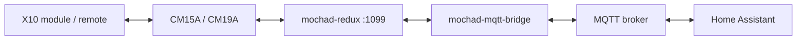

# mochad-mqtt-bridge

[](https://github.com/Monsterray/mochad-mqtt-bridge/actions/workflows/bridge-python-ci.yml)
[](https://github.com/Monsterray/mochad-mqtt-bridge/releases)
[](LICENSE.md)

Bring X10 devices into Home Assistant through MQTT Discovery.

The bridge connects an external mochad TCP service to MQTT. Configured devices
appear as Home Assistant lights, switches, or action buttons, grouped under one
MQTT Mochad Bridge device with concise connection diagnostics.

## Project Family

- [mochad-redux](https://github.com/Monsterray/mochad-redux): controller
  communication, USB, X10 protocols, and the main TCP listener.
- [mochad-docker](https://github.com/Monsterray/mochad-docker): optional
  container packaging for the daemon.
- **mochad-mqtt-bridge**: MQTT transport, Home Assistant discovery, state
  inference, device capabilities, and reconnect behavior.

This repository does not build mochad and never accesses USB directly.

## Highlights

- Automatic Home Assistant MQTT Discovery for configured X10 devices.
- Stable X10-address topic and unique-ID identity even when names change.
- Generic switch, light, and action-only capability profiles.
- Bridge, mochad, USB, controller, and version diagnostic entities.
- Safe Home Assistant controls for state sync and rediscovery.
- Reconnect and degraded startup behavior when MQTT or mochad is unavailable.
- Optional verified MQTT TLS, custom CA trust, and mutual TLS.
- Retained discovery registry with opt-in stale-entity cleanup.

No representative repository-owned Home Assistant screenshot is currently
available. This README does not use a fabricated or third-party image.

## Quick Start

Create the local environment:

```sh
git clone https://github.com/Monsterray/mochad-mqtt-bridge.git
cd mochad-mqtt-bridge
cp .env.example .env
```

Start with this minimal `.env` configuration:

```text
MOCHAD_HOST=mochad
MQTT_HOST=mosquitto
MQTT_USERNAME=
MQTT_PASSWORD=
X10_DEVICES=A1:Living Room Lamp:light,A2:Coffee Maker:switch
```

Set `MOCHAD_HOST` and `MQTT_HOST` to reachable names or addresses. Empty MQTT
credentials are valid only when the broker allows anonymous access.

The standalone Compose file expects an external network named `mqtt`:

```sh
docker network create mqtt
docker compose up --build -d
docker compose logs -f mochad-mqtt-bridge
```

Set `MQTT_DOCKER_NETWORK` if the broker uses another Docker network. Once MQTT
Discovery is enabled in Home Assistant, configured entities should appear
automatically under the MQTT Mochad Bridge device.

For a published release image, replace the Compose `build:` block only after
confirming the desired tag exists in GHCR:

```yaml
image: ghcr.io/monsterray/mochad-mqtt-bridge:0.4.0
```

## Architecture



The bridge uses the main newline-delimited mochad listener on port `1099`.
Port `1100` is a legacy NUL-delimited XMLSocket compatibility listener and is
not supported by the bridge.

Protocol text handling stays in the protocol package, device state in the
state manager, discovery payloads in discovery, topic construction in the
topic helper, and TCP/MQTT clients remain transport focused.

## Requirements

- A reachable mochad service, tested with upstream `mochad 0.1.18` and
  maintained `mochad-redux`.
- An MQTT broker such as Eclipse Mosquitto.
- Home Assistant with MQTT configured for automatic discovery.
- Docker with Compose v2, or Python 3.11 through 3.13 for source execution.
- Broker ACL access to `x10/#` and the configured Home Assistant discovery
  prefix.

The bridge starts in degraded mode when either external service is unavailable
and reconnects in process.

## Common Configuration

Generic profiles describe behavior explicitly without claiming support for a
particular product model:

| Type | Commands | Home Assistant | Retained state |
| --- | --- | --- | --- |
| `switch` | `ON`, `OFF` | Switch | Yes |
| `light` | `ON`, `OFF`, `DIM`, `BRIGHT` | Light | Yes |
| `chime` | `ON` | Button | No |

The generic `chime` is action-only: every intentional `ON` is sent, no
optimistic `ON` state is published, and transmission remains physically
unconfirmed.

Example with bridge-side command repeats:

```text
X10_DEVICES=A1:Living Room Lamp:light:3:150,A2:Coffee Maker:switch:1:150
```

The fourth field is repeat count and the fifth is delay in milliseconds.
Only `ON` and `OFF` repeat; `DIM` and `BRIGHT` remain single-shot.

Named hardware profiles make evidence-backed claims and are gated separately.
`sc546a_chime` remains experimental, requires
`ALLOW_EXPERIMENTAL_PROFILES=true`, has fixture verification but not hardware
verification, and retains the same action-only behavior. Research profiles are
not selectable.

Friendly names affect Home Assistant display names only. MQTT topics and
unique IDs always use stable addresses such as `A1` and `x10_A1`.

Runtime configuration is stored under `/config`. If
`/config/bridge.json` is absent, the bridge creates it from environment-derived
settings and then watches it for supported updates. Existing files are not
overwritten.

The complete environment catalog, JSON format, house-code filtering,
permissions, TLS, and secret-file behavior are in
[configuration](docs/configuration.md).

## Project Status

The project version comes from [VERSION](VERSION), with immutable release image
inputs tracked separately in [release/versions.env](release/versions.env).

The current release line is a cautious public beta. Software can confirm that
a command was transmitted to mochad, but not that a physical X10 module acted.
Named profiles are exposed according to their evidence lifecycle rather than
being presented as broadly supported.

Use tagged beta releases or exact full Git SHAs for testing. Consult
[beta status](docs/beta-status.md), [compatibility](docs/compatibility.md), and
the checks attached to the exact tested commit.

## Documentation

- [Configuration reference](docs/configuration.md)
- [MQTT topics and bridge controls](docs/mqtt-topics.md)
- [Capability-driven device registry](docs/capability-device-registry.md)
- [SC546A promotion evaluation](docs/sc546a-promotion-evaluation.md)
- [Generated supported-profile catalog](docs/supported-profiles.md)
- [Named-profile migration](docs/device-profile-migration.md)
- [Sanitized support bundles](docs/support-bundles.md)
- [Configuration backup and isolated restore](docs/backup-and-restore.md)
- [Compatibility](docs/compatibility.md)
- [Future mochad JSON API](docs/future-mochad-json-api.md)
- [Release engineering](docs/release-engineering.md)
- [CI and branch protection](docs/ci-branch-protection.md)
- [Security policy](SECURITY.md)

## Development and Testing

Create a virtual environment and run the source suite:

```sh
python3 -m venv .venv
. .venv/bin/activate
python -m pip install -r requirements.txt -r requirements-dev.txt
python -m compileall -q .
pytest
```

Focused integration tests use a fake mochad server and test-controlled
Mosquitto. Container and multiarchitecture checks run separately so the full
unit suite can stay fast across supported Python versions.

The release workflow validates image labels, exact dependencies, Compose,
container runtime behavior, `linux/amd64`, and `linux/arm64`. Physical CM19A
and module outcomes remain human-approved hardware evidence.

## Related Projects

- [mochad-redux](https://github.com/Monsterray/mochad-redux)
- [mochad-docker](https://github.com/Monsterray/mochad-docker)
- [Home Assistant MQTT integration](https://www.home-assistant.io/integrations/mqtt/)
- [Eclipse Mosquitto](https://mosquitto.org/)

## Contributing

Read [CONTRIBUTING.md](CONTRIBUTING.md) before opening a change. Reports should
include the exact version or SHA, Python or image version, mochad version,
controller and modules, installation method, sanitized bridge logs, and
rollback result. Never include MQTT passwords, private keys, or production
credentials.

## License

MIT. See [LICENSE.md](LICENSE.md).
